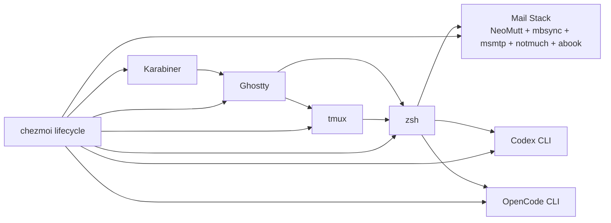

# System Overview

How the chezmoi source tree maps to the target filesystem, what gets deployed, and what stays source-only.

## Component Interaction Model

Input flows from the physical keyboard through Karabiner (home row mods, hyper key), into Ghostty (terminal keybindings), then into tmux (prefix commands) or directly to zsh (shell keybindings). From zsh, input reaches Codex, OpenCode, NeoMutt, and other terminal tools managed by the repo. Chezmoi manages configuration for all layers, including the mail stack and its launchd automation.

## Source-to-Target Mapping

Chezmoi translates source-state file names to target paths using naming conventions (`private_`, `dot_`, `encrypted_`, `.tmpl`).

| Source (chezmoi) | Target | Notes |
|---|---|---|
| `.chezmoi.toml.tmpl` | `~/.config/chezmoi/chezmoi.toml` | Config, profile selection, encryption settings |
| `key.txt.age` | _(source-only)_ | Passphrase-encrypted age private key |
| `bin/chezmoi-bws` | _(source-only)_ | BWS token wrapper script |
| `literal_bin/` | `~/bin/` | Shell utility scripts |
| `private_dot_ssh/` | `~/.ssh/` | SSH keys (encrypted) |
| `private_dot_config/` | `~/.config/` | Application configs |
| `private_dot_codex/modify_private_config.toml.tmpl` | `~/.codex/config.toml` | Codex CLI defaults merged into existing runtime config |
| `private_dot_config/isyncrc.tmpl` | `~/.config/isyncrc` | mbsync/isync config |
| `private_dot_config/msmtp/private_config.tmpl` | `~/.config/msmtp/config` | SMTP account config |
| `private_dot_config/notmuch/default/config.tmpl` | `~/.config/notmuch/default/config` | notmuch profile config |
| `private_dot_config/notmuch/default/hooks/executable_post-new.tmpl` | `~/.config/notmuch/default/hooks/post-new` | post-index account/folder tagging |
| `private_dot_config/neomutt/` | `~/.config/neomutt/` | NeoMutt entrypoint, includes, mailcap |
| `private_dot_config/abook/` | `~/.config/abook/` | Abook config |
| `private_dot_config/terraform/terraform.rc` | `~/.config/terraform/terraform.rc` | Terraform CLI defaults |
| `private_dot_local/private_share/abook/` | `~/.local/share/abook/` | Abook data |
| `private_dot_config/brew/Brewfile` | `~/.config/brew/Brewfile` | Homebrew bundle |
| `dev/personal/golden-vault/dot_obsidian/` | `~/dev/personal/golden-vault/.obsidian/` | Obsidian vault config for the separate notes repo |
| `dev/personal/golden-vault/dot_gitignore` | `~/dev/personal/golden-vault/.gitignore` | Notes repo ignore policy; keeps `.obsidian/` owned by dotfiles |
| `dev/personal/obsidian/secondbrain/dot_obsidian/` | `~/dev/personal/obsidian/secondbrain/.obsidian/` | Obsidian vault config for the secondbrain notes repo |
| `dev/personal/obsidian/secondbrain/dot_gitignore` | `~/dev/personal/obsidian/secondbrain/.gitignore` | Notes repo ignore policy; keeps `.obsidian/` owned by dotfiles |
| `private_Documents/NotesOfTheGods/dot_obsidian/` | `~/Documents/NotesOfTheGods/.obsidian/` | Legacy local vault config restored via dotfiles; note content remains in place |
| `private_Library/LaunchAgents/com.lpersonal.mail-sync.plist.tmpl` | `~/Library/LaunchAgents/com.lpersonal.mail-sync.plist` | Mail sync scheduler (ignored until accounts are configured) |
| `literal_bin/executable_mail-*` | `~/bin/mail-*` | Mail helper scripts (`mail-sync`, `mail-open`) |
| `.chezmoiscripts/` | _(lifecycle scripts)_ | Before/after scripts (e.g. LaunchAgent reload, Ghostty-only Cmd+H override), not deployed |
| `.chezmoidata.yaml` | _(template data)_ | Catppuccin Mocha color palette |
| `dot_zshenv.tmpl` | `~/.zshenv` | Zsh bootstrap (exports `ZDOTDIR`) |
| `private_dot_config/zsh/` | `~/.config/zsh/` | Zsh entry point and module files |

_Reference: `AGENTS.md:78`_

## Source-Only Directories

These directories exist in the repo but are never deployed to the target filesystem:

| Directory | Purpose |
|---|---|
| `ai-docs/` | Crawled documentation for AI agents |
| `code-portable-data/` | VS Code portable data |
| `bin/chezmoi-bws` | BWS helper (used during template rendering only) |
| `bin/chezmoi-diff-pager` | Chezmoi diff pager wrapper (uses `diffnav`, falls back to `cat`) |
| `docs/` | This documentation tree |

_Reference: `.chezmoiignore:11`_

## Ignored Artifacts

The `.chezmoiignore` file uses **target-state paths** (not source-state names) and supports chezmoi template conditionals:

- **Build artifacts:** `node_modules/`, `target/`, `__pycache__/`, lock files
- **Caches:** `.cache/`, `.config/carapace/.versions`, `lazy-lock.json`, yazi plugins
- **Runtime state:** `.obsidian/`, `.DS_Store`
- **Obsidian vault generated files:** Plugin runtime files (`main.js`, `styles.css`), plugin caches, and `workspace.json` under the managed Obsidian vaults are ignored — settings JSONs, manifests, themes, icons, and plugin `data.json` files remain managed. The required runtime assets for `obsidian-kanban`, `dataview`, `quick-tagger`, and `obsidian-git` are bootstrapped after apply by `.chezmoiscripts/run_after_09-obsidian-community-plugins.sh.tmpl`
- **Mail-conditional:** mail LaunchAgent is ignored until at least one enabled account exists
- **OS-conditional:** macOS-only configs (Aerospace, Karabiner, Finicky, SketchyBar, Ghostty LaunchAgent, mail LaunchAgent) excluded on Linux

_Reference: `.chezmoiignore:19`, `.chezmoiignore:54`_

## Profile System

The config template (`.chezmoi.toml.tmpl`) hardcodes a single active profile:

1. `profile = "lpersonal"`
2. Placeholder `name` and `email` values are rendered until you replace them.
3. Chezmoi's diff pager points to a source-only helper that uses `diffnav` when available and falls back to `cat` during first bootstrap.
4. Bitwarden template support remains available for future secrets, but no live encrypted payloads ship in the baseline.

The package bootstrap script pre-taps any third-party Brewfile taps before `brew bundle --no-upgrade` runs and validates every Brewfile formula/cask up front, so renamed or tap-missing entries fail fast with a clear summary instead of leaving a fresh machine partially configured.

_Reference: `.chezmoi.toml.tmpl:1`_

## Secrets Baseline

The `lpersonal` baseline ships without the original maintainer's encrypted files,
SSH material, mail credentials, or Bitwarden token. Reintroduce age recipients,
encrypted files, and personal secret rendering only after generating your own
keys and tokens.

## References

- Root AGENTS: `AGENTS.md:78` (key paths table)
- Chezmoi config template: `.chezmoi.toml.tmpl:1`
- Ignore rules: `.chezmoiignore:1`
- Encryption section: `AGENTS.md:62`
